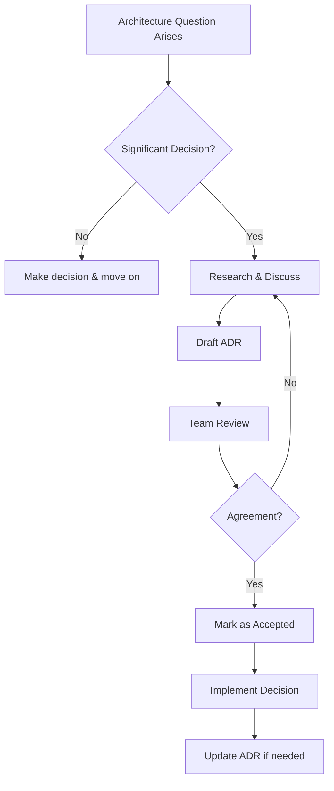

Ever been in a code review where someone asks, "Why did we build it this way?" and nobody remembers? Or worse, you're refactoring six months later, thinking "What idiot made this decision?" only to realize it was you?

Yeah, me too. That's exactly why I started using **Architecture Decision Records (ADRs)**.

## What the Heck is an ADR?

An ADR is a short document that captures a single architectural decision. Think of it as a journal entry for your codebase—but instead of "Dear Diary, today I felt sad," it's more like "Dear Future Dev, here's why we chose PostgreSQL over MongoDB."

The concept comes from Michael Nygard's blog post back in 2011, and it's beautifully simple: **document the decisions that matter, when they matter, in a format that doesn't make you want to cry.**

## Why Should You Care?

### 1. **Memory is Terrible**

I can barely remember what I had for breakfast, let alone why I chose a specific design pattern three months ago. ADRs are your external brain.

### 2. **Onboarding New Team Members**

When someone joins your team, they can read through ADRs and understand not just *what* the architecture looks like, but *why* it evolved that way. It's like having a time machine for context.

### 3. **Avoiding Repeated Debates**

Ever had the same architectural debate multiple times? "Should we use REST or GraphQL?" ADRs let you say, "We already discussed this—check ADR-005."

### 4. **Historical Context**

Technologies and requirements change. What seemed like a dumb decision three years ago might have made perfect sense given the constraints at the time. ADRs preserve that context.

## Anatomy of an ADR

Here's the structure I use (and most people follow):

```markdown
# ADR-001: Use PostgreSQL for Primary Database

## Status
Accepted

## Context
We need a database for our e-commerce application. Requirements:
- ACID compliance for financial transactions
- Complex querying capabilities for product search
- Team has strong SQL experience
- Need to handle 10k+ transactions/day initially

## Decision
We will use PostgreSQL as our primary database.

## Consequences

### Positive
- Robust ACID guarantees for payment processing
- Powerful JSON support (JSONB) for flexible product attributes
- Excellent ecosystem and tooling
- Team can be productive immediately
- Free and open source

### Negative
- More complex horizontal scaling compared to NoSQL
- Requires careful schema design upfront
- Need to manage migrations carefully

### Neutral
- Will need connection pooling (PgBouncer) at scale
- Monitoring setup required for performance tracking
```

That's it. Clean, simple, and **actually useful**.

## The Key Sections Explained

### Status
Usually one of: **Proposed**, **Accepted**, **Deprecated**, **Superseded**

When you supersede an ADR, link to the new one. For example:
```markdown
## Status
Superseded by [ADR-015: Migrate to Aurora PostgreSQL](./adr-015.md)
```

### Context
This is the **why** section. What problem are you solving? What constraints exist? What alternatives did you consider?

Be honest here. Include the messy details:
- Technical constraints ("Our current hosting only supports X")
- Business constraints ("We need to launch in 2 months")
- Team constraints ("Nobody knows Rust")

### Decision
Short and declarative. "We will..." or "We have decided to..."

No wishy-washy language. If you're writing an ADR, a decision has been made.

### Consequences
This is where you show you've actually thought things through. List the **positive**, **negative**, and **neutral** outcomes.

The negative consequences are especially important. They show you made an informed choice, not a naive one.

## My Real-World ADR Example

Let me show you one from my own project (this blog, actually):

```markdown
# ADR-003: Use rehype-mermaid for Diagram Rendering

## Status
Accepted

## Context
I want to include diagrams in blog posts without:
- Manually creating PNG/SVG files
- Maintaining external diagram files
- Requiring client-side JavaScript for rendering
- Sacrificing page load performance

I write in Markdown/MDX and want diagrams to be version-controlled
as code.

## Decision
Use rehype-mermaid to render Mermaid diagrams at build time.

## Consequences

### Positive
- Diagrams are just text in Markdown—easy to version control
- No client-side JavaScript needed (renders to SVG at build)
- Faster page loads—diagrams are pre-rendered
- Better accessibility—proper SVG markup
- Can write diagrams without leaving code editor

### Negative
- Requires Playwright installation during build (adds ~1-2s)
- Build fails if Playwright browsers aren't installed
- Limited to Mermaid syntax (can't use other diagram tools easily)
- Must rebuild site to see diagram changes

### Neutral
- Need to run 'pnpm exec playwright install --with-deps chromium'
  in CI/CD pipeline
- Mermaid version is locked to rehype-mermaid's dependencies
```

Notice how I included the **actual** negative consequences? The Playwright requirement bit me in CI/CD, and documenting it saved my future self hours of debugging.

## The Workflow

Here's how I use ADRs in practice:



Not every decision needs an ADR. I use this rule of thumb: **If it's hard to reverse, document it.**

## Where to Store ADRs

I keep mine in the repo:

```
project/
├── docs/
│   └── adr/
│       ├── 0001-use-typescript.md
│       ├── 0002-choose-astro-framework.md
│       └── 0003-use-rehype-mermaid.md
```

Some teams use:
- `/adr` in the root
- `/docs/decisions`
- A wiki (though I prefer Git-tracked files)

The key is: **Keep them close to the code.**

## Tools to Make This Easy

You don't need fancy tools, but these help:

### adr-tools
```bash
# Install
npm install -g adr-log

# Create new ADR
adr new "Use GraphQL for API"

# List all ADRs
adr list
```

### VS Code Extension
Search for "ADR Tools" in VS Code extensions. Auto-numbering and templates included.

### Templates
Create a template in your repo:

```markdown
# ADR-XXX: [Title]

## Status
[Proposed | Accepted | Deprecated | Superseded]

## Context
[What is the issue we're seeing? What constraints exist?]

## Decision
[What are we doing?]

## Consequences
### Positive
- 

### Negative
- 

### Neutral
- 
```

## Common Mistakes (That I've Made)

### 1. **Writing a Novel**
Keep it short. If you're hitting 1000+ words, you're probably writing multiple ADRs.

### 2. **Being Too Vague**
Bad: "We chose the best database."
Good: "We chose PostgreSQL because X, Y, Z."

### 3. **Skipping the Negatives**
Every decision has tradeoffs. If you don't list any negatives, you haven't thought it through.

### 4. **Never Updating**
ADRs aren't write-once. If you discover new consequences, update the ADR.

### 5. **ADR Theater**
Don't write ADRs just to check a box. Write them when they add value.

## When NOT to Use ADRs

You don't need an ADR for:
- Implementation details (variable names, file organization)
- Temporary decisions ("Let's prototype with library X")
- Obvious choices ("Use Git for version control")

Save ADRs for decisions that:
- Affect the system's structure
- Are hard to reverse
- Influence future development

## Getting Your Team On Board

I started using ADRs solo, then gradually sold the team:

1. **Started small** - Documented a recent controversial decision
2. **Shared the value** - Linked to the ADR when someone asked "Why did we...?"
3. **Made it easy** - Created templates and scripts
4. **Led by example** - Wrote ADRs for my own decisions

Now? The team asks me if something needs an ADR. Cultural win.

## The Bottom Line

ADRs are **lightweight documentation that actually gets used**. They're not architecture astronaut material—they're practical, pragmatic, and helpful.

Start with your next significant decision. Write it down. Your future self will thank you.

And hey, when someone asks "Why did we build it this way?" you can just drop a link and say, "ADR-007, my friend. ADR-007."

---

**Want to learn more?**
- [Michael Nygard's original post](https://cognitect.com/blog/2011/11/15/documenting-architecture-decisions)
- [adr.github.io](https://adr.github.io/) - Collection of ADR examples
- [ADR Tools](https://github.com/npryce/adr-tools) - Command-line tools for managing ADRs

_Have you used ADRs in your projects? What's worked for you? Let's chat on [GitHub](https://github.com/preamza02) or [LinkedIn](https://www.linkedin.com/in/supakone-kongprapan/)!_
