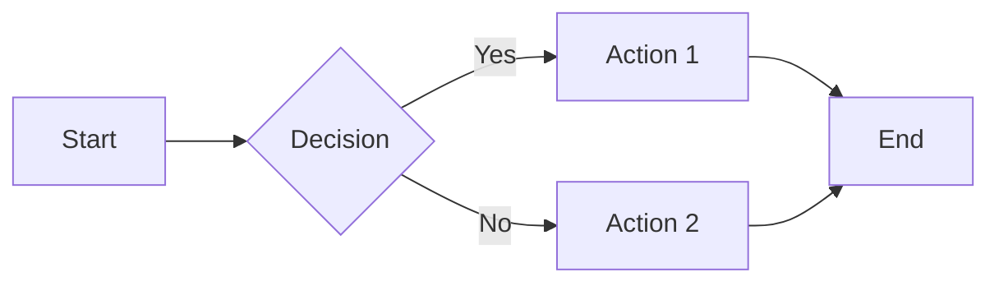
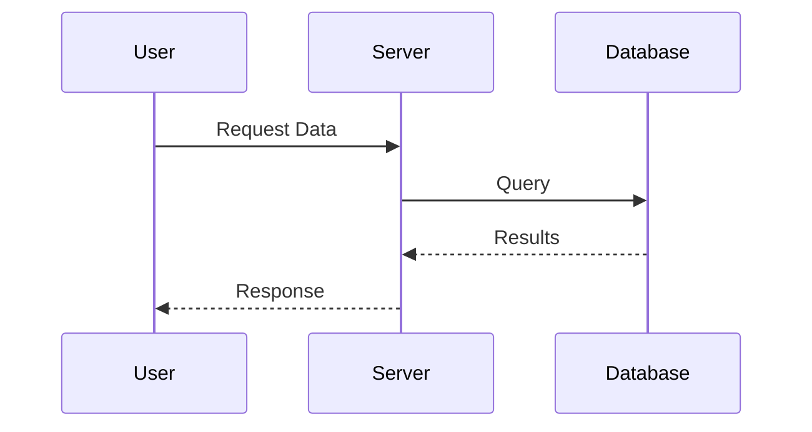
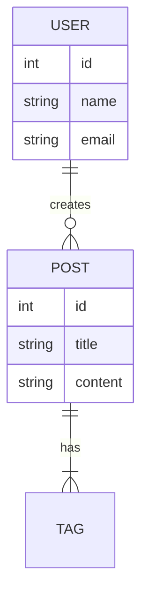

Have you ever struggled with creating diagrams for your documentation? Do you find yourself constantly switching between diagramming tools and your code editor? **Mermaid Chart** might be the solution you've been looking for.

## What is Mermaid?

[Mermaid](https://mermaid.js.org/) is a JavaScript-based diagramming and charting tool that renders Markdown-inspired text definitions to create and modify diagrams dynamically. It integrates seamlessly with documentation, and you can define diagrams using simple text syntax right in your Markdown files.

## Why Use Mermaid?

1. **Version Control Friendly**: Since diagrams are defined in text, they can be tracked in Git just like your code
2. **Easy to Maintain**: Update diagrams by simply editing text - no need to open external tools
3. **Consistent Styling**: Diagrams inherit your documentation theme automatically
4. **Wide Support**: Supported by GitHub, GitLab, Notion, and many documentation tools

## Basic Diagram Types

Mermaid supports various diagram types:

### Flowchart

### Sequence Diagram

### Entity Relationship Diagram

## How This Blog Uses Mermaid

This website (supakone.me) uses the `rehype-mermaid` plugin to render Mermaid diagrams at build time. This means:

- **No client-side JavaScript** needed for diagram rendering
- **Faster page loads** since diagrams are pre-rendered as SVG
- **Better accessibility** with proper SVG markup

## Getting Started

To use Mermaid in your Markdown-based documentation:

1. Add Mermaid support to your static site generator
2. Write your diagram code in a fenced code block with `mermaid` as the language
3. Build your site and enjoy beautiful diagrams!

## Conclusion

Mermaid Chart is an excellent tool for developers and technical writers who want to create diagrams without leaving their text editor. It's especially powerful when combined with Markdown-based documentation systems like Starlight (which powers this blog).

Want to learn more? Check out the [official Mermaid documentation](https://mermaid.js.org/intro/) for more diagram types and syntax options.
