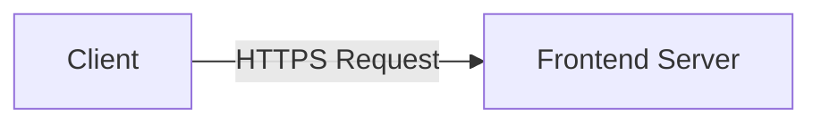

Welcome to the implementation details of Supakone.me! This document outlines the technical aspects and architecture of the website.

## Architecture Overview 

## Technical Perspectives

- **Frontend Framework:** Astro with Starlight template
- **Markdown Processing:** MDX for content creation
- **Version Control** : Git and GitHub
- **CI/CD** : GitHub Actions for automated deployment

### File Structure

This Project is built using Astro Framework with starlight integration So the file structure is Similar to standard Startlight Project

import { FileTree } from '@astrojs/starlight/components';

<FileTree>
  
- docs/
  - astro.config.mjs
  - src/
    - content/
      - docs/
        - docs/
          - index.mdx
          - implementation.mdx
          - roadmap.mdx
      - info/
        - work/
          - software_engineer.md
          - content_creator.md  
    - layouts/
    - components/
    - const/
    - styles/
  - public/
  - .gitignore
  - package.json
  - tsconfig.json
  - README.md
- LICENSE
- README.md
</FileTree>

## ADR (Architecture Decision Record)

### ADR-0001: Choosing Frontend Framework

Status: Accepted

Deciders: [Supakone Kongprapan](https://github.com/preamza02)

Date: 2025-11-24

Technical Story: [issue-001](https://github.com/preamza02/supakone.me/issues/1)

#### Context and Problem Statement
When building Supakone.me, I needed to choose a frontend framework that would allow me to create a fast, maintainable, and scalable personal website.

And also I want a feature-rich template document builder that uses markdown built-in website while allowing me to customize it easily

Decision Drivers
- Markdown Support
- Maintainability
- Static Site Generation
- Performance
- Community and Ecosystem

Considered Options
- Option 1: Astro with Starlight
- Option 2: Hugo
- Option 3: Docusaurus.io 

Decision Outcome

Chosen Option: "Astro with Starlight", while all options support markdown and static site generations, 
Astro with Starlight offers the best in terms of customization from Community plugin and (as I research) have the best performance
also with Astro no javascript principle I think this is the best choice for my personal website.
